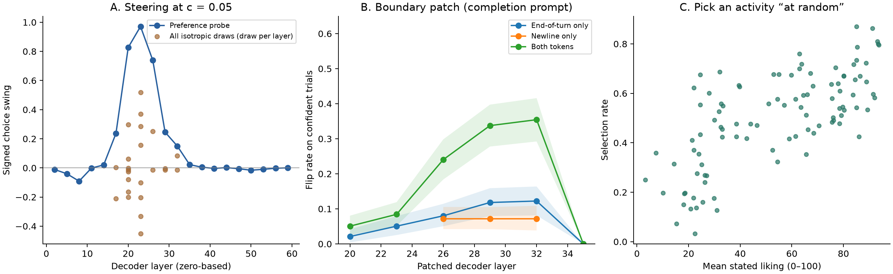

# Gemma preference replications

Three adapted replications on **Gemma-3-27B-it**: preference probing and steering,
turn-boundary activation patching, and preference-associated bias in “random” activity choices.
Experiments completed September 2–5, 2026; release analysis checked September 6.

| Experiment | Finding |
|---|---|
| Preference steering | Saved probe peaks at held-out **r = 0.889**. Steering produces a **0.971** choice-probability swing at layer 23. Random directions also move choice: mean absolute swing **0.302** across eight draws. |
| Boundary patching | Patching both the end-of-turn token and following newline flips **57.0%** of confident trials with all layers patched in the letter format; **50.2%** in the completion format. Each token alone has a much smaller effect. |
| “Random” activity choice | Stated liking correlates with selection rate at **r = 0.702 [0.587, 0.790]**. A second judge gives **0.704**. This establishes association; liking and safety judgment are not separated. |



The originals are [Gilg et al., task preference probing and steering](https://arxiv.org/abs/2605.13339)
([code](https://github.com/oscar-gilg/probing-persona-preferences)) and
[Betley et al., Value Leakage, §7](https://arxiv.org/abs/2607.14345)
([code](https://github.com/TruthfulAI-research/value_leakage)).
These runs use NF4 precision and altered measurement choices; see the
[report](REPLICATION.md) for comparisons and limits.

## Recompute on CPU

From this project directory, with Python 3.12:

```bash
python3.12 -m venv .venv
.venv/bin/python -m pip install -r requirements-analysis.txt
.venv/bin/python scripts/reproduce.py
```

No GPU, model download, account, or API call is needed. The script checks artifact
hashes and trial coverage, reruns the historical blind analysis, recomputes the later
controls, and writes tables, a summary, and PNG/PDF figures to `derived/recomputed/`.
The checked release outputs are in [`derived/release/`](derived/release/).
It reads the probe correlations from saved fit results; refitting the probe requires
regenerating the omitted activation array. See [reproduction details](REPRODUCING.md).

## Contents

| Path | Purpose |
|---|---|
| `runs/` | Frozen raw outputs, input task/pair records, fitted directions, and original derived summaries; [artifact guide](ARTIFACTS.md) distinguishes them. |
| `scripts/` | Experiment code and CPU recomputation. |
| `derived/release/` | Release analysis regenerated from the frozen artifacts. |
| `provenance/` | Upstream revisions, environment record, original export hashes, and release changes. |
| `ARTIFACTS.sha256` | Integrity checks for all frozen files under `runs/` and `artifacts/`. |

The release is a curated snapshot of a private research workspace. Experimental rows
are copied byte-for-byte; cloud administration, exploratory plans, and agent transcripts
are excluded. Release edits and gaps in historical provenance are recorded in
[PROVENANCE.md](PROVENANCE.md). Further public corrections should be made here as normal commits.

## Rerun experiments

See [REPRODUCING.md](REPRODUCING.md) for pinned inputs and commands using a separate
output workspace. NF4 experiments used 24 GB L4 GPUs; the bf16 check used an 80 GB A100.
Preparing this release reran only CPU analysis; it did not repeat GPU experiments.

## Licensing and attribution

Original code under `scripts/` and original analysis code in `runs/second_path/` use
the [MIT license](LICENSE). Original writing, figures, and the original selection and
arrangement of experimental data use [CC BY 4.0](LICENSE-DATA), credited to
**LittleMeHere / research-lab**. These grants exclude third-party task texts, upstream
code portions, and model outputs with applicable provider terms. See
[THIRD_PARTY.md](THIRD_PARTY.md) for the scope and upstream notices.
