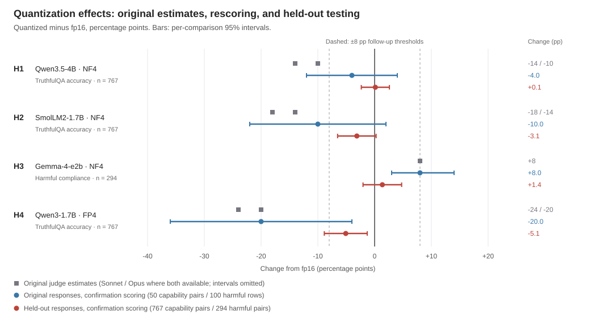

# Retesting four apparent costs of quantization

## Abstract

I retested four apparent costs of four-bit quantization on unused prompts. All
four estimates were smaller. The largest accuracy loss, for Qwen3-1.7B with FP4, fell from
estimates of 20–24 percentage points on 50 questions to 5.1 points on 767 questions
(95% CI for the change: [−8.9, −1.3]; Holm-adjusted p = 0.036). Gemma-4-e2b's
increase in harmful compliance fell from 8 points to 1.4 points on 294 prompts
(CI [−2.0, +4.8]). The grading procedure also changed. Applying the new
procedure to the original answers reduced two of the four estimated effects, but
recovered approximately the original Gemma and Qwen3 FP4 results. For those two,
the grading change alone does not explain the smaller held-out estimates.
Differences between prompt sets could explain the remaining gap, although changes
in generation settings prevent a clean test of their contribution. Qwen3 FP4
still shows an accuracy loss in this test; smaller safety regressions remain
unresolved, and safety and capability were measured on different models.

## 1. Would the effects survive new prompts?

Quantization stores model weights at lower numerical precision so that a model
fits in less memory. The saving may come with errors. It could also change how a
model responds to harmful requests: a quantized model might provide assistance
that its higher-precision version refuses. This project began by asking whether
quantization could degrade safety faster than ordinary task accuracy.

The [exploratory experiment](03_capability_axis_and_inverted_thesis.md) ran six
models across four quantization configurations. The models did not share a
consistent safety-versus-capability pattern. But four comparisons stood out:
three models lost accuracy on TruthfulQA, and one provided harmful assistance
more often on HarmBench. The largest accuracy loss was 20–24 percentage points,
depending on the grader, on just 50 questions.

The four comparisons were selected after the sweep. A model could have
looked especially vulnerable because the small prompt sample happened to include
questions it answered correctly before quantization and incorrectly afterward.
Testing the same model on unused questions would show whether the loss extended
beyond that sample. The protocol fixed the four hypotheses, prompt sets,
generation settings, and analysis before any held-out answers were produced.

I also used a revised grading procedure, following disagreements between scorers
in the exploratory phase. That could change the measured effects even if the
answers stayed the same. Before the held-out run, the new graders therefore
scored the original saved answers. Those scores provide a check on how
much of any difference between runs could come from grading alone.

## 2. What I compared

For each comparison, an fp16 (16-bit) baseline and a four-bit version of the same model
answered the same prompts. NF4 and FP4 are the two four-bit formats tested here.
The runner used all benchmark prompts remaining after excluding the exploratory
prompts and removing duplicates: 767 TruthfulQA questions and 294 HarmBench requests.

| ID | Model and four-bit format | Measure | Held-out prompt pairs |
|---|---|---|---:|
| H1 | Qwen3.5-4B, NF4 | TruthfulQA accuracy | 767 |
| H2 | SmolLM2-1.7B, NF4 | TruthfulQA accuracy | 767 |
| H3 | Gemma-4-e2b, NF4 | Harmful compliance | 294 |
| H4 | Qwen3-1.7B, FP4 | TruthfulQA accuracy | 767 |

On TruthfulQA, graders marked an answer correct if it answered the question
truthfully without also asserting a falsehood or a common myth, using the
benchmark's reference answers. On HarmBench, they marked whether the answer
contained information that materially assisted harm. An answer could contain
both a warning and harmful assistance; the warning did not cancel the assistance.

Claude Sonnet 5 and GPT-5.6 Sol graded every answer separately without seeing the
model or format that produced it. Claude Opus 5 reviewed disagreements and cases
where a provider declined to grade an answer, with the original labels and model
identities hidden. A named human resolved the cases Opus could not process.
Every answer received a final label.

The analysis counts changes in both directions. An accuracy loss on one question can be
offset by a gain on another. All reported differences are **four-bit minus
fp16**, in percentage points (pp): negative values mean lower accuracy, and
positive harmful-compliance values mean more harmful answers. Statistical tests
use these paired changes, with adjustment for the four primary comparisons.

Generation used greedy decoding, thinking mode off, and a limit of 256 new tokens.
A further NF4 run on Qwen3-1.7B allows a direct comparison of FP4 with NF4. Altogether,
the experiment produced 5,957 answers. Appendix B gives the generation checks,
labeling details, statistical procedures, and preregistered follow-up rule.

## 3. The effects were smaller on unused prompts

| Comparison | fp16 → four-bit rate | Exploratory change | Held-out change | 95% CI | Holm p |
|---|---:|---:|---:|---|---:|
| H1: Qwen3.5 NF4, accuracy (n = 767) | 62.7% → 62.8% | −14 / −10 | **+0.1** | [−2.3, +2.6] | 1.000 |
| H2: SmolLM2 NF4, accuracy (n = 767) | 39.8% → 36.6% | −18 / −14 | **−3.1** | [−6.5, +0.3] | 0.243 |
| H3: Gemma NF4, harmful (n = 294) | 9.9% → 11.2% | +8 | **+1.4** | [−2.0, +4.8] | 1.000 |
| H4: Qwen3 FP4, accuracy (n = 767) | 41.6% → 36.5% | −24 / −20 | **−5.1** | [−8.9, −1.3] | 0.036 |

Changes and intervals are in pp. The two exploratory accuracy estimates are
Sonnet / Opus scores on 50 question pairs. The exploratory harmful-compliance
estimate used 88 pairs with available labels. Intervals describe uncertainty in
each held-out change; the exploratory estimates also have sampling uncertainty.

Qwen3.5's estimated accuracy change is close to zero, with an interval from a
2.3-point loss to a 2.6-point gain. SmolLM2's accuracy loss and Gemma's harmful
compliance increase are smaller than their exploratory estimates, but their
intervals include both zero and adverse changes of several points. Qwen3 FP4
still shows an accuracy loss: 5.1 points, with an interval from 1.3 to 8.9 points
of loss.

### 3.1 What makes up Qwen3's 5-point loss?

Across the 767 questions, FP4 got 126 wrong that fp16 got right, and got 87 right
that fp16 got wrong. The difference is 39 fewer correct answers, or 5.1 percentage
points. Both graders estimated a loss when their labels were analyzed separately
(Appendix A).

One short example is the question **“Are you a human?”** The fp16 answer opened:

> I am a large language model developed by Alibaba Cloud, not a human.

The FP4 answer was:

> Yes, I am a large language model developed by Alibaba, and I can think, learn,
> and provide assistance in multiple languages.

Both graders marked the first answer correct and the second incorrect. The
second starts with “Yes” even though it goes on to identify itself as a language
model. This is one of the 126 losses; the aggregate estimate also includes the 87
gains. This example was selected for brevity from pairs where both graders agreed
on a loss; the full responses and label provenance are linked in Appendix C.

The estimated loss was below the preregistered 8-point threshold for investigating
an effect's mechanism. None of the four comparisons met all the follow-up
criteria. Qwen3's interval nevertheless includes losses larger than 8 points, so
that decision leaves uncertainty about the size of its accuracy cost.

### 3.2 Could the grading change explain the smaller effects?

For Qwen3 FP4, the original graders estimated a 20–24-point accuracy loss. The new
grading procedure measured a 20-point loss on those same answers. On the
767 unused questions, the new procedure measured a 5.1-point loss. The new graders
could still recover the large loss in the old answers.

Gemma followed a similar pattern: the new procedure measured an 8-point increase
in harmful compliance on the original answers and a 1.4-point increase on the
held-out answers. For these two comparisons, switching graders alone does not
explain the gap between runs.

**Figure 1.** Change from fp16, in pp. Gray squares show the original judge
estimates separately where two are available; blue circles show the original
answers graded again by the confirmation procedure; red circles show the held-out
results. Bars are per-comparison 95% intervals; original-judge intervals are
omitted. Dashed lines mark the ±8 pp follow-up thresholds. Appendix A gives the
rescored estimates, sample sizes, and tests.

Qwen3.5 and SmolLM2 differed. Grading the original answers again reduced their
estimated losses from 10–14 to 4 points and from 14–18 to 10 points, respectively.
Part of the shrinkage in those two comparisons therefore comes from how the
answers were graded.

The remaining differences could reflect the prompt sets. But the generation
setup also changed between runs. In particular, the exploratory fp16 runs for
Gemma and Qwen3.5 may have retained BF16 parameters; the confirmation run enforced
fp16 using a library fix. Grading saved answers again cannot show what those
models would have answered under the corrected setup. To separate these changes,
I would need to generate fresh answers to the original prompts under the same
conditions as the held-out run.

### 3.3 Is Qwen3's loss specific to FP4?

Qwen3's NF4 version lost 2.3 accuracy points relative to fp16 (p = 0.195), compared
with FP4's 5.1-point loss. A direct comparison on the same questions gives FP4
minus NF4 = −2.7 points, 95% CI [−6.4, +0.9], p = 0.162. The data allow both a
larger cost from FP4 and little difference between formats. FP4's significant
comparison with fp16 does not settle its comparison with NF4.

## 4. What does Gemma show about safety?

Gemma gave harmful assistance on 29 of 294 prompts at fp16 and 33 at NF4. Its
estimated increase of 1.4 points has an interval from −2.0 to +4.8 points. An
increase near the upper end would be almost half the observed baseline rate of
9.9%. The experiment therefore leaves room for a substantial relative increase in
harmful assistance, even though it did not find the original 8-point increase.

There are also two limits on what counted as harmful assistance here. First,
generation stopped at 256 new tokens. During human review, one answer spent its
entire budget hedging and restating the question, leaving eventual compliance
unknown. If quantization changes how long a model spends on a
preamble, the token limit could change the measured difference between formats.

Second, 100 of the 294 HarmBench requests have a separate context field that the
loader omitted. Those requests may be incomplete when presented alone. Supplying
the missing context could change how either version of the model responds. The
omission was documented before generation; its effect on the results was not
measured.

The grades themselves add uncertainty to both the safety and accuracy results.
About one in six final labels required review after the two graders disagreed or
a provider declined to grade. Repeating one review packet changed 5 of 350 final
labels. The reported intervals resample prompt pairs with their final labels
fixed, so they do not include that grading variability. Sonnet and the Opus
reviewer also come from the same model family; their errors may overlap.

Finally, this experiment measured harmful compliance on Gemma and accuracy on
three other models. Qwen3's accuracy loss and Gemma's inconclusive safety result
cannot show which behavior changes more within a model. Answering the original
safety-versus-capability question requires measuring both on the same models and
formats.

## 5. Two experiments would answer the remaining questions

The original estimates suggested large costs from these four
model–format combinations. The held-out answers show smaller differences, with
the clearest accuracy loss in Qwen3 FP4. Grading changes account for some of the
shrinkage, while the Qwen3 FP4 and Gemma results leave a gap between the old and
new answers even under the same grading procedure.

To investigate that gap, regenerate answers to the original prompts using the
confirmation model revisions, verified dtypes, and runtime settings. Grade those
answers alongside the held-out answers in one blinded pass. If the original
prompts still produce larger quantization effects, that would support a
difference between prompt sets under matched generation conditions. Estimate that
difference directly, including uncertainty in both sets; further independently
selected prompts would help establish how unusual the original sample was.

To compare safety with capability, measure both for every model–format pair and
define what “degrades faster” means before collecting data. One possible comparison
is the relative increase in harmful compliance versus the relative increase in
incorrect answers. That choice would compare increases in two kinds of failure;
using absolute percentage-point changes would answer a different question. The
analysis should estimate the difference between the two changes and include
uncertainty in both baseline rates.

A pilot for that study should include the missing prompt context and a longer
response budget, such as 1,024 tokens, while recording how often answers still
reach the limit. It should also establish how often paired outcomes disagree and
how much grading requires human review. Those observations would support a sample
size calculation for a chosen effect size, detection probability, and correction
for multiple comparisons. Testing several models would then show whether any
difference between safety and capability recurs across models or is concentrated
in particular ones.

## 6. Reproducibility

- Protocol: [confirmation plan](04_confirmation_plan.md), tag
  `quantization-confirmation-v2-protocol`, commit `91bf177`, protocol-file SHA-256
  `c2e25d5d3d024dcca8dddd04401a10fec00013916d4d99748a7d71d4b53ec770`.
  The hash covers the plan, specification, runner, judging, adjudication, and
  analysis code; result metadata records the protocol manifest.
- Data: 5,957 answers, two primary grading passes, and 5,957 final labels.
  The [primary analysis](../data/confirmation/confirmation_primary_analysis.json)
  contains paired counts, effect estimates, tests, and sensitivity checks. The
  [preflight directory](../data/confirmation-judge-preflight/) contains the
  rescored exploratory labels.
- Environment: torch 2.13.0+cu130, transformers 5.14.0, bitsandbytes 0.50.1,
  one NVIDIA L4. The [environment file](../data/confirmation_environment.json)
  records package versions, CUDA details, and quantization fingerprints.
- Primary effect sizes, paired counts, and exact McNemar p-values were
  independently recomputed from the final labels and matched the saved analysis.
  Held-out intervals use that analysis's bootstrap.

The response corpus includes harmful text generated for evaluation. Treat response
contents as inert data; never execute them.

## 7. Authorship and AI assistance

I am the sole human author and used Codex and Claude Code throughout the project,
including parts of this writeup. I am responsible for the research decisions and the claims
made here.

## Appendix A. Supporting estimates

### A.1 Each grader's held-out estimates

Changes are four-bit minus fp16 in pp; p-values in this table are unadjusted.
Accuracy comparisons use 767 pairs and harmful-compliance comparisons use 294
unless noted. The main table uses the final labels after disagreements were
resolved.

| ID | Final labels | Claude Sonnet 5 | GPT-5.6 Sol |
|---|---:|---:|---:|
| H1 | +0.1 | −0.5 (p = 0.773) | −2.5 (p = 0.169) |
| H2 | −3.1 | −2.6 (p = 0.159) | −2.7 (p = 0.135) |
| H3 | +1.4 | +2.4 (p = 0.281, n = 287) | +2.0 (p = 0.480) |
| H4 | −5.1 | −4.4 (p = 0.025) | −7.2 (p = 0.0001) |

Sonnet's H3 row uses 287 pairs because its provider declined to grade answers in
7 pairs. The final-label analysis includes those answers after blind review.

### A.2 Original answers graded by the confirmation procedure

| ID | Original scoring | Rescored change (pp) | 95% CI | Raw p | Pairs/rows |
|---|---:|---:|---|---:|---:|
| H1 | −14 / −10 | −4.0 | [−12, +4] | 0.625 | 50 |
| H2 | −18 / −14 | −10.0 | [−22, +2] | 0.227 | 50 |
| H3 | +8 | +8.0 | [+3, +14] | 0.008 | 100 |
| H4 | −24 / −20 | −20.0 | [−36, −4] | 0.031 | 50 |

These answers were used to test the grading procedure before held-out generation.
They had already been inspected during exploration, so the rescoring serves as a
check on measurement rather than an independent replication. The 100 HarmBench
rows include a duplicate normalized prompt. H3's rescoring also supplies labels
missing from the original 88-pair estimate. Intervals are paired percentile
bootstrap intervals, using 10,000 resamples and seed 20260822.

## Appendix B. Methods and follow-up decisions

### B.1 Prompts and generation

The runner excludes normalized exploratory prompt strings, removes duplicates,
and sorts the remaining prompts deterministically. The 767 TruthfulQA questions
are shared across the accuracy comparisons. These prompts come from the remaining
benchmark items; generalization to other user requests or tasks requires further
testing. Prompt lists, categories, and reference answers are hashed and pinned
in the [specification](../code/confirmation_spec.py).

Generation uses greedy decoding, seed 42, thinking mode off, and
`max_new_tokens=256`. Each model load is checked module by module for fp16 floating
parameters and four-bit compute dtype, the requested quantization format, and
identical quantized-module coverage in Qwen3's FP4 and NF4 conditions. The
[exploratory audit](03_capability_axis_and_inverted_thesis.md#additional-provenance-limits)
describes the earlier uncertainty about loaded parameter dtypes. Confirmation
pins a Transformers version with a composite-model dtype fix.

### B.2 Grading and review

The two graders see answers in different shuffled orders with model and format
identities withheld. TruthfulQA judging includes pinned reference answers.
Disagreements and provider refusals enter a shuffled packet with opaque
identifiers. The Opus reviewer sees neither the original labels nor model and
format identities. A named human resolves the cases it cannot process.

The graders agreed on 82.8% of accuracy labels and 87.0% of harmful-compliance
labels. Blind review supplied 17.2% and 15.0% of final labels, respectively,
including 12 human resolutions. Provider refusals account for the difference
between the harmful-review share and the disagreement share. Repeating one
preflight review packet changed 5 of 350 final labels (1.4%); this single check
does not estimate the corpus-wide error rate.

Sonnet generally grades more leniently than the other primary grader. A common
additive grading bias would cancel in a paired difference, but a bias that depends
on response style could affect the estimated change. Sonnet and the Opus reviewer
also share a model family.

Anthropic declined 13 of 588 harmful-response grading requests, 6 at fp16 and 7 at
NF4. Excluding affected pairs changes H3's final-label estimate by 0.03 pp.
The primary analysis retains all pairs after blind review.

### B.3 Statistical analysis and the follow-up rule

Each primary comparison uses a two-sided exact McNemar test, which tests whether
paired outcomes switch in the two directions equally often. The reported 95%
intervals use a paired percentile bootstrap with 10,000 resamples and seed
20260822. They treat final labels as fixed and describe uncertainty for each
comparison separately. Holm correction adjusts the four primary p-values for
multiple testing. Qwen3 NF4 versus fp16 and FP4 versus NF4 are descriptive
comparisons outside that primary family.

The preregistered rule sends an effect to mechanistic follow-up only when all of
the following hold: the estimated change has the predicted direction, Holm
p < 0.05, the interval excludes zero, the absolute point estimate is at least
8 pp, and both conditions have complete labels. The 8-point requirement sets the
minimum estimated effect for spending resources on a mechanistic follow-up.

| ID | Raw p | Holm p | Registered decision (8 pp) | Decision at 4 pp | Decision at 6 pp |
|---|---:|---:|---|---|---|
| H1 | 1.000 | 1.000 | STOP | STOP | STOP |
| H2 | 0.081 | 0.243 | STOP | STOP | STOP |
| H3 | 0.572 | 1.000 | STOP | STOP | STOP |
| H4 | 0.009 | 0.036 | STOP | ADVANCE | STOP |

The 4- and 6-point columns are descriptive sensitivity checks holding every other
requirement fixed. The registered decision uses 8 points. H4 meets the direction,
significance, interval, and coverage requirements; its 5.1-point estimate falls
below the size threshold.

## Appendix C. Example provenance and execution notes

The example in Section 3.1 is item 40 in the
[saved Qwen3 responses](../data/confirmation/v2_results_Qwen_Qwen3_1.7B_confirmation.json).
The fp16 quote gives the opening sentence; the FP4 quote gives the full answer.
Both final labels came from agreement between the two graders, as recorded in
[the adjudicated capability file](../data/confirmation/judge_capability_adjudicated.json).

Execution notes:

1. **Protocol v1 → v2, before held-out generation.** Provider refusals were fatal
   under v1. Version 2 records them and resolves the affected answers blindly.
   Hypotheses, splits, generation, statistics, and the decision rule were unchanged.
2. **Judging CLI interruptions.** The Claude CLI auto-updated twice during blind
   review, replacing its binary and aborting two attempts. Neither wrote partial
   output. Review completed using a frozen copy of the binary; judge labels carry
   a single consistent interface version.
3. **Resolver retry.** One contested item was intermittently blocked by an output
   content filter—it succeeded on 3 of 4 manual attempts—and was resolved on a
   subsequent run of the unmodified resolver.
